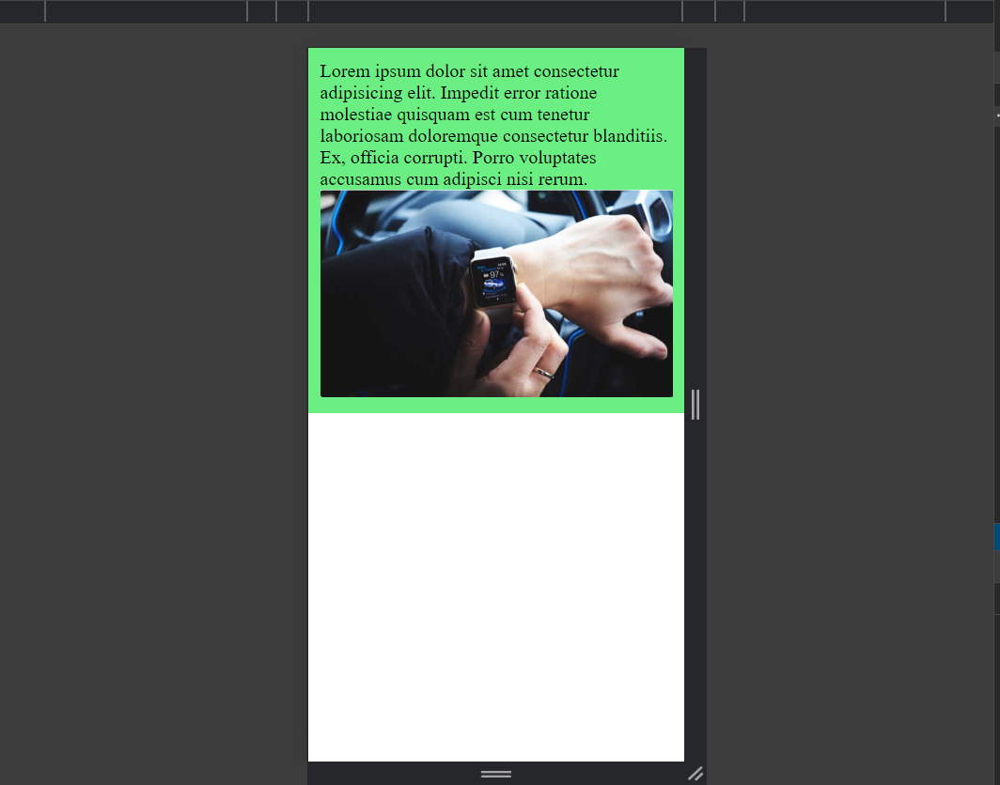
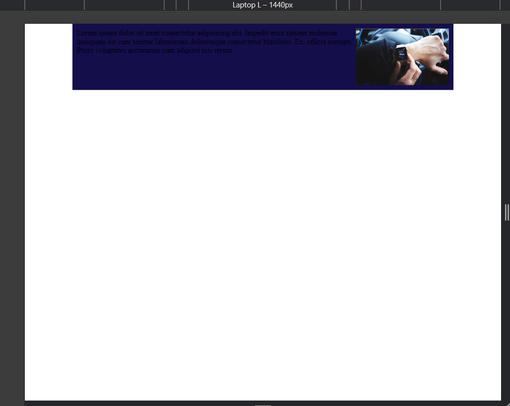

<h1><i>RESPONSIVE</i></h1>

In this project, I created a small responsive example where on screens larger than mobile, the text and photo are positioned side by side with a blue background, while on mobile and smaller screens, the text and photo are stacked vertically with a green background.

